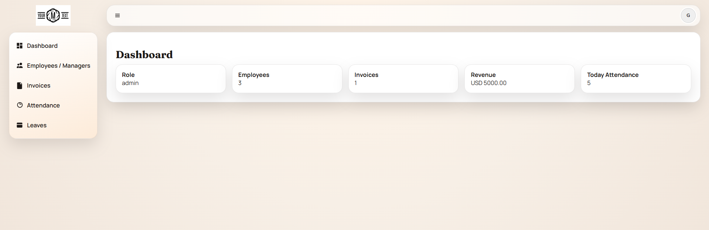
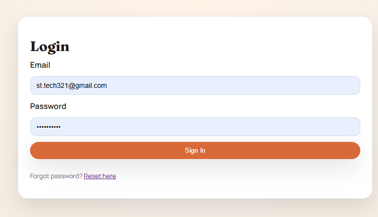

# WorkFlow ERP

Modern WorkFlow ERP web application to manage employees, invoices, attendance, leave requests, and profile/settings with secure JWT authentication.

---

## What This Project Does

This project helps a company run daily HR and operations workflows from one dashboard:

- Employee records and roles
- Attendance (check-in, check-out, breaks)
- Leave request and approval flow
- Invoice tracking
- User profile and settings management
- Secure login with JWT

---

## Role Permissions (Current)

This project uses role-based access with three roles: `admin`, `manager`, and `employee`.

### Admin
- Full access to all authenticated modules
- Create, update, delete employees (both `manager` and `employee`)
- Create user accounts and reset employee user passwords
- Create, update, delete invoices
- Manage attendance records (including manual breaks and delete attendance entries)
- Approve/reject/pending leave requests and manage leave policies
- Update company logo/settings

### Manager
- Can create employee records and employee user accounts with role `employee` only
- Cannot create or promote another `manager`
- Can manage employees, invoices, attendance records, and leave policies within manager scope
- Cannot approve leave when the requester is a `manager` (admin-only approval)
- Can update company logo/settings

### Employee
- Access own account features (`/me`, update profile, change password)
- Use attendance self-service actions: check-in, break start/end, check-out, and attendance list
- Create/update/delete own leave requests (subject to handler ownership rules)
- View leave balances

### Quick Access Matrix

| Module / Action | Admin | Manager | Employee |
|---|---|---|---|
| Dashboard view | ✅ | ✅ | ✅ |
| Employees list | ✅ | ✅ | ✅ |
| Employees create/update/delete | ✅ (manager + employee) | ✅ (employee only) | ❌ |
| Employee user/password management | ✅ (manager + employee) | ✅ (employee only) | ❌ |
| Invoices list | ✅ | ✅ | ✅ |
| Invoices create/update/delete | ✅ | ✅ | ❌ |
| Attendance check-in/out & breaks | ✅ | ✅ | ✅ |
| Attendance manual break/delete records | ✅ | ✅ | ❌ |
| Leave request create/update/delete | ✅ | ✅ | ✅ |
| Leave approve/reject/pending | ✅ | ✅* | ❌ |
| Leave policy view/update | ✅ | ✅ | ❌ |
| Settings logo view | ✅ | ✅ | ✅ |
| Settings logo update | ✅ | ✅ | ❌ |

> `*` Manager cannot approve leave for a requester with role `manager`; only admin can.

> Note: This matrix reflects the current backend route middleware and handler-level checks.

---

## Technology Used

### Backend
- **Language:** Go
- **Framework:** Gin
- **Database ORM:** GORM
- **Database:** MySQL
- **Auth:** JWT (access + refresh tokens)

### Frontend
- **Language:** TypeScript
- **Framework:** React (Vite)
- **HTTP Client:** Axios
- **Routing:** React Router

---

## Add Project Images Here


### 1) Dashboard 


### 2) Login 


### 3) Attendance 


---

## Backend Overview

Backend is in `backend/` and provides REST APIs under `/api`.

- Public auth APIs: login, refresh token, forgot-password OTP
- Protected APIs: dashboard, employees, invoices, attendance, leaves, profile, settings
- JWT middleware protects private routes
- DB schema is handled through GORM auto-migration

---

## Project Installation

### Prerequisites
- Go 1.21+
- Node.js 18+
- Docker

### 1) Clone project
```bash
git clone <your-repo-url>
cd Erp_go
cd WorkflowErp
```

### 2) Start database
```bash
docker compose up -d
```

### 3) Install frontend dependencies
```bash
cd frontend
npm install
cd ..
```

---

## Environment Setup

### Backend `.env` (`backend/.env`)
```env
APP_ENV=local
APP_ADDR=:8080
DB_DSN=erp_user:erp_password@tcp(127.0.0.1:3306)/erp_db?charset=utf8mb4&parseTime=True&loc=Local
JWT_SECRET=change_this_secret
JWT_ACCESS_MINUTES=15
JWT_REFRESH_HOURS=168
OTP_MINUTES=10
SMTP_HOST=smtp.gmail.com
SMTP_PORT=587
SMTP_USER=your_email
SMTP_PASS=your_app_password
SMTP_FROM=WorkFlow ERP Support <your_email>
ALLOWED_ORIGINS=http://localhost:5175
```

### Frontend `.env` (`frontend/.env`)
```env
VITE_API_URL=http://localhost:8080
```

---

## Run Backend Server

```bash
cd backend
go run ./cmd/server
```

Backend starts on `http://localhost:8080` (based on `APP_ADDR`).

---

## Run Frontend Server

```bash
cd frontend
npm run dev
```

Frontend starts on Vite default URL (usually `http://localhost:5173`).

---

## Data Migration Command

This project uses **GORM AutoMigrate**.

- Migration runs automatically when backend starts.
- Command to run migration (auto):

```bash
cd backend
go run ./cmd/server
```

Optional build check:
```bash
cd backend
go build ./...
```

---

## Important Note (Auth)

- Login + JWT + refresh flow is active.
- Forgot-password OTP flow is active.
